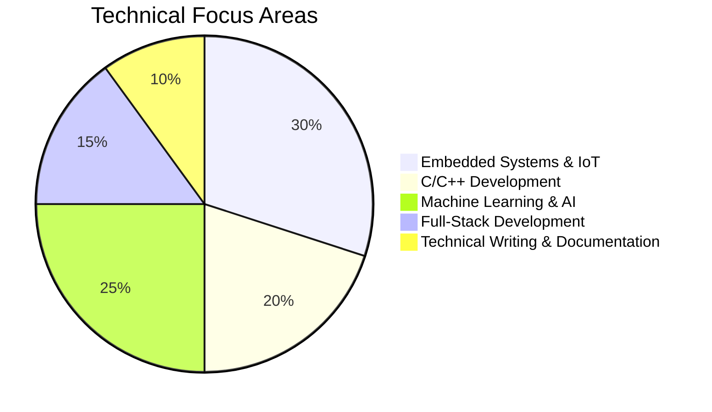

<!--
  README.md for GitHub Profile — Rehan Mokashi (rmokashi01)
  Last updated: April 2025 (based on latest resume)
  Copy this entire file into your `rmokashi01` repository.
-->

  

<h1 align="center">👋 Hey, I'm Rehan Mokashi</h1>

<h3 align="center">M.Tech CSE Student |  Full Stack & Embedded - IoT Developer | Academic Researcher & Writer</h3>

  <a href="mailto:rehanmokashi786@gmail.com">✉️ Email</a> •
  <a href="https://www.linkedin.com/in/rehan-mokashi-7b32472a2/">🔗 LinkedIn</a> •
  <a href="https://github.com/rmokashi01">🐙 GitHub</a> •
  <a href="https://rmokashi01.github.io/rehan-portfolio/">🌐 Portfolio</a> •
  <a href="https://leetcode.com/u/rmokashi01/">🟠 LeetCode</a> •
  <!-- UPDATE: Replace with your actual resume link -->
  <a href="https://drive.google.com/file/d/1k8zbXmcWzO74qaTYAFANQTRSXke3JNaK/view?usp=sharing">📄 Résumé</a>

  
  
   
   
   
  

---

  

---

## 🧭 About Me

I'm an M.Tech student in Computer Science & Engineering at Government College of Engineering, Karad, with a strong foundation in embedded systems, IoT, and machine learning. My work bridges hardware and software, and I’m passionate about clear documentation and academic publishing.

* 🎓 **M.Tech CSE** — Government College of Engineering, Karad (Pursuing, Sem1 SPI: **9.2/10**)
* 🎓 **B.Tech CSE** — Annasaheb Dange College of Engineering & Technology (CGPA: **8.84/10**)
* 🏅 **Best Research Paper Awards** — ICRTET 2026 (DYP Group) & VIVIBHA IIM Jammu
* 📄 **Published Researcher** — 6+ papers in IEEE and international journals (ML/IoT applications)
* 🛠️ **Technical Interests** — Embedded firmware, AI on edge devices, full‑stack development, and tech writing
* 🎯 **Career Goal** — Roles that combine embedded systems, AI, and academic/technical editing

---

## 🧰 Tech Stack & Tools

**Programming Languages:**  

**Hardware & Embedded:**  

**Frameworks & Libraries:**  

**Cloud & Tools:**  

**Academic & Publishing Tools:**  

---

## 🎯 Professional Experience

### **Embedded Systems Trainee** @ [Emertxe Information Technology](https://www.emertxe.com/) | Bengaluru, KA  
_Mar 2025 – Jan 2026_  
- 2 Weeks Linux, 3 Months Register‑level C, 1 Month C++, 2 Months DSA, 2 Months Microcontroller training with PIC simulations.  
- Developed projects: AddressBook, MP3 Tag Reader‑Editor, LSB Steganography Tool, NumCraft CLI Tool, and 5+ more.

### **Virtual Intern – Embedded Systems** @ [Microchip Technology Inc.](https://www.microchip.com/) | Remote  
_Nov 2024 – Mar 2025_ · [Certificate](https://verify.skilljar.com/c/ink3ked288wi)  
- Worked on Bluetooth Low Energy, 8‑bit microcontrollers, dsPIC motor control, and dual‑core Digital Signal Controllers.  
- Completed 8 projects during the internship ([repo](https://github.com/rmokashi01?tab=repositories)).

### **Robotics & Embedded Intern** @ [e‑Yantra, IIT Bombay](https://www.e-yantra.org/) | Remote  
_Oct 2023 – Nov 2024_ · [Certificate](https://www.linkedin.com/posts/rehan-mokashi-7b32472a2_felicitation-day-activity-7192437274767167488-0Kcp)  
- Mentored 50+ students in robotics and embedded basics through workshops.  
- Secured **Top 10 Rank in India** in IIT Bombay hackathon (project: Hospital Helper Robot).

### **IoT Developer Intern** @ [Bolt IoT](https://www.boltiot.com/) | Bengaluru, KA  
_Aug 2023 – Oct 2023_ · [Certificate](https://www.linkedin.com/posts/rehan-mokashi-7b32472a2_assured-internship-offer-letterbolt-iot-activity-7163650922349256705-VNdO)  
- Integrated ML with IoT for data logging, threshold alerts, and cloud dashboards.  
- Validated sensor accuracy and improved reliability across diverse conditions.

### **Software Developer Intern** @ Domain Computers | Sangli, MH  
_May 2023 – Jul 2023_ · [Certificate](https://drive.google.com/file/d/1qWd22NhAbygOrFYyfOUW7uEAk2IHa-mK/view)  
- Built web modules using Flask, HTML/CSS/JS, and MySQL; optimised database queries.  
- Assisted with UI development and deployment activities.

---

## 🗂️ Featured Projects

### 🌾 [ML-Based Fertilizer Recommendation](https://github.com/rmokashi01/fertilizer-yield-optimization.git)
Built a LightGBM model to predict crop yield from soil nutrients & weather data – **R² = 0.874** on Maharashtra dataset.  
`Python` `LightGBM` `Machine Learning` `Agriculture`

### 👁️ [AI Vision System on AMB82-Mini (Embedded + GenAI)](https://www.linkedin.com/posts/rehan-mokashi-7b32472a2_embeddedai-computervision-genai-activity-7390665288255561729-uHxv)
Integrated Google Gemini Vision API for real‑time image description; implemented WiFi cloud inference with custom C++ firmware.  
`C++` `ESP32` `Gemini API` `Edge AI`

### 🚆 [Railway Crossing Automation](https://drive.google.com/file/d/1VjxroAEGgH6zmxXc7MwPPcZQ-af5qMlD/view?usp=drive_link) | [Alt Link](https://drive.google.com/file/d/1ti6ghPsxuVgYhF3X2Q0_REw-ziL1FBmZ/view?usp=drive_link)
Automated railway gate system using Raspberry Pi, YOLOv8, ESP32, and MQTT alerts for remote monitoring.  
`Python` `YOLOv8` `IoT` `Raspberry Pi` `MQTT`

### 🔢 [NumCraft – Number Systems CLI Tool](https://github.com/rmokashi01/numcraft-cli-tool-c)
Interactive CLI for number system conversions and binary arithmetic.  
`C` `CLI` `Bitwise Operations` `Educational Tool`

### 🌐 [International Conference Website – GCE Karad](https://www.iccetac.in/)
Developed & deployed a full‑stack conference management site on AWS with registration and event data handling.  
`HTML` `CSS` `JS` `Node.js` `AWS`

---

## 📚 Publications & Research Articles

| Publication | Links |
|-------------|-------|
| **Enhancing Railway Line Safety** – ML‑based image processing for obstacle detection (GRENZE IJET) | [Paper](https://thegrenze.com/index.php?display=page&view=journalabstract&absid=6345&id=8) |
| **ML‑Based Fertilizer Recommendation** – Predictive model for crop response (ICCETAC - IEEE) | [Paper](https://www.ijteonline.in/assets/uploads/issue_pdf/1771004264.pdf) |
| **Nanofluid Properties Prediction** – ML for thermophysical properties (ICRTET - IEEE) *Under process* | [PDF](https://drive.google.com/file/d/1hMFBPAtqhbDFnwYw2lLsDsmX707lZZQD/view?usp=drive_link) |
| **Smart Healthcare Ecosystem** – IoT‑based multi‑disease screening framework (ICRTET - IEEE) *Under publication* | [PDF](https://drive.google.com/file/d/1y59HUjuqCCxZculZyrD4VJEKdGM_Ey8W/view?usp=drive_link) |
| **Food Waste to Fertilizer** – Review of rapid composting technologies (ICCETAC - IEEE) | [Paper](https://www.ijteonline.in/assets/uploads/issue_pdf/1771004264.pdf) |
| **Bridging Bench‑to‑Bedside Gap** – YOLO‑based brain tumor diagnosis (ICRTET - IEEE) | [Paper](https://www.ijteonline.in/assets/uploads/issue_pdf/1771004264.pdf) |

---

## 🏆 Achievements & Awards

- 🥇 **Best Research Paper Award** at ICRTET 2026 (DYP Group) – [Certificate](https://www.linkedin.com/posts/rehan-i-mokashi-7b32472a2_icrtet-dyp-2026-activity-7425789791105097728-FwyH)
- 🥇 **Best Research Paper Award** at VIVIBHA IIM Jammu – [Certificate](https://www.linkedin.com/posts/rehan-i-mokashi-7b32472a2_felicitating-activity-7264145446606901248-7PNK)
- 🏅 **Top 10 Rank in India** – Hackathon conducted by IIT Bombay – [Certificate](https://www.linkedin.com/posts/rehan-i-mokashi-7b32472a2_certificates-activity-7192426559159308288-fQlW)

---

## 🎓 Education

| Degree | Institute | Duration | Performance |
|--------|-----------|----------|-------------|
| **M.Tech** in Computer Science & Engineering | Government College of Engineering, Karad | Sept 2025 – Aug 2027 | SPI (Sem1): 9.2/10 |
| **B.Tech** in CSE (IoT & Cyber Security) | Annasaheb Dange College of Engineering & Technology, Ashta | Oct 2022 – July 2025 | CGPA: 8.84/10 (A+) |
| **Diploma** in Computer Engineering | Sant Gajanan Maharaj Rural Polytechnic, Mahagaon | Oct 2022 – July 2025 | 83.20% (A+) |

---

## 📊 GitHub Analytics

  
  

  

## 💻 LeetCode Progress

  

  <a href="https://leetcode.com/u/rmokashi01/">Visit My LeetCode Profile</a>

---

## 📈 Skills Visualization

---

## 📬 Let's Connect

I’m always open to research collaborations, embedded projects, or academic writing opportunities. Feel free to reach out!

  
  
  
  

---

  <i>“Code is like humor. When you have to explain it, it’s bad.” – Cory House</i>

