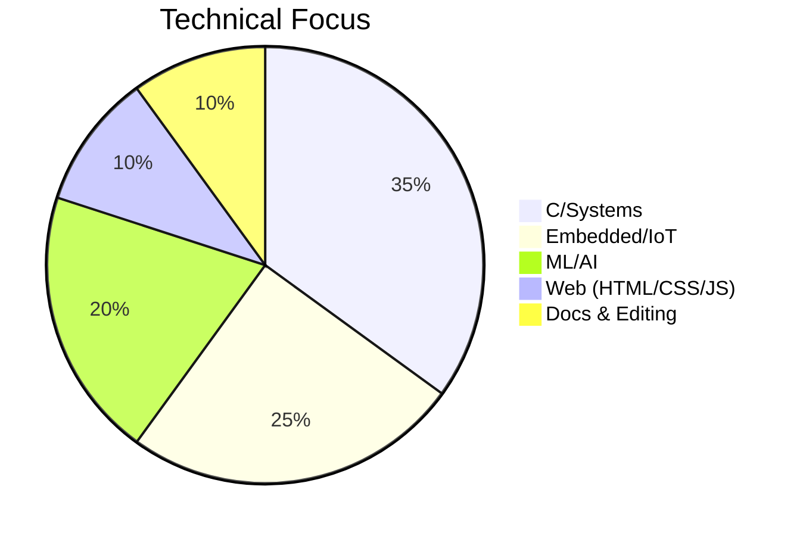
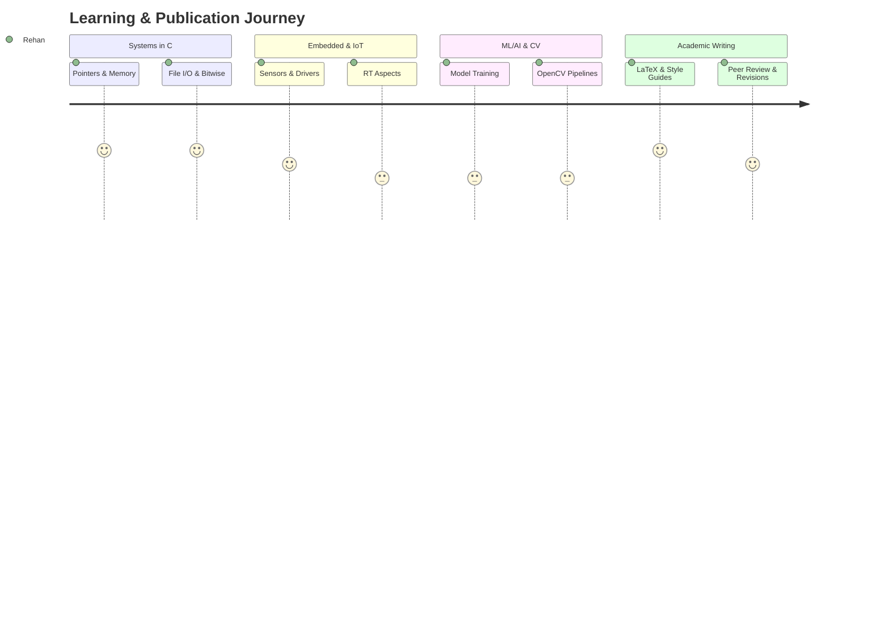
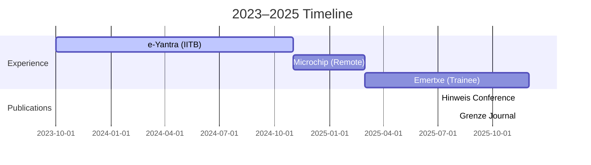

<!--
  README.md for GitHub Profile — Rehan Mokashi (rmokashi01)
  Copy this entire file into a repo named exactly `rmokashi01` (public).
  Many sections are dynamic image cards — they render automatically on GitHub.
-->

<h1 align="center">👋 Hey, I'm Rehan Mokashi</h1>

  Final‑year B.Tech CSE (Dec 2025) • Embedded/IoT • C/Systems • Scientific writing & publication
   
  <a href="mailto:rehanmokashi786@gmail.com">✉️ Email</a> •
  <a href="https://www.linkedin.com/in/rehan-mokashi-7b32472a2/">🔗 LinkedIn</a> •
  <a href="https://github.com/rmokashi01">🐙 GitHub</a>
   
  
  
  

  

---

## 🧭 About Me

* 🎓 **B.Tech CSE** — Annasaheb Dange College of Engineering & Technology (CGPA **8.84/10**)
* 🏅 **Best Research Paper Award** — IIM Jammu (Mar 2025)
* 📄 **Publications** — Grenze Journal (Aug 2025), Hinweis Research (Jul 2025)
* 🛠️ I enjoy **file I/O**, **bitwise tricks**, **CLI UX**, and writing **clear docs**
* 🎯 Seeking **Academic/Publication Editor** roles where tech + writing meet

---

## 🧰 Tech & Tools

**Languages**: C, C++, Python, JavaScript, SQL
**Domains**: IoT, Embedded, ML/AI, Computer Vision
**Frameworks/Libraries**: TensorFlow, OpenCV, scikit‑learn
**Tooling**: Git/GitHub, Make,
**Writing/Editing**: LaTeX, Overleaf, Mendeley/Zotero, Grammarly, Paperpal, iThenticate, Editorial Manager, ScholarOne

  
  
  
  
  
  
  
  
  

---

## 🎯 Highlights

* 🧪 **Trainee @ Emertxe (Mar 2025 – Present)** — Embedded/IoT, with emphasis on **technical documentation**
* 🧭 **e‑Yantra (IIT Bombay) Intern (Oct 2023 – Nov 2024)** — Mentored **50+** students, authored workshop docs
* 🔧 **Microchip Technology (Nov 2024 – Mar 2025)** — Hardware debugging, driver reports, performance notes

---

## 🗂️ Featured Projects

> Pin these repos on your profile for quick visibility.

* 🔢 **NumCraft (C)** — Interactive number‑systems CLI: converters, two’s complement, quizzes
  `C • CLI • bitwise`
  👉 [https://github.com/rmokashi01/numcraft-cli-tool-c](https://github.com/rmokashi01/numcraft-cli-tool-c)
* 📇 **Address Book (C)** — CRUD contacts with validation + CSV persistence
  `C • file I/O • validation`
  👉 [https://github.com/rmokashi01/Address-Book-Project](https://github.com/rmokashi01/Address-Book-Project)
* 🌐 **Portfolio (HTML/CSS)** — Simple personal web portfolio
  👉 [https://github.com/rmokashi01/rehan-portfolio](https://github.com/rmokashi01/rehan-portfolio)

---

## 🏆 Publications & Awards (Table)

| Year       | Venue            | Title / Note                                 | Type       |
| ---------- | ---------------- | -------------------------------------------- | ---------- |
| 2025       | IIM Jammu        | Best Research Paper Award                    | Award      |
| 2025-08-04 | Grenze Journal   | ML‑based image processing for railway safety | Journal    |
| 2025-07    | Hinweis Research | IoT‑ML Integrated Railway Safety Framework   | Conference |

> Add DOIs/links once available for quick verification.

---

## 📚 Education (Compact)

| Degree      | Institute             | Tenure    | Score   |
| ----------- | --------------------- | --------- | ------- |
| B.Tech CSE  | ADCET, Ashta          | 2022–2025 | 8.84/10 |
| Diploma CSE | SGM Rural Polytechnic | 2019–2022 | 83.20%  |

---

## 📈 Visuals (Mermaid Charts)

> GitHub supports **Mermaid** diagrams natively. They render automatically on your profile.

### Skill Mix — Pie

### Learning Journey — User Journey Map

### Timeline — Publications/Experience

---

## 🤖 Fun Bits (Cartoons & Icons)

  <!-- Replace with your own image/illustration links if you prefer -->
  
  

Click for a quick CLI joke

> There are only 10 kinds of people in the world: those who understand binary and those who don't.

---

## 📊 GitHub Analytics (Auto‑generated Cards)

  

  

  

  

---

## 🧪 Certifications (Examples for ATS)

> Swap placeholders with your real credential links or remove ones you don't want to show.

* AWS Solutions Architect – Associate (2024)
* Google Cloud Data Engineer (2023)
* TensorFlow Developer (2023)
* Azure AI Engineer (2024)

---

## 📝 How I Edit (for Academic Editor roles)

* 🧭 **Clarity First**: active voice, consistent tense, and scoped claims
* 🔬 **Accuracy**: fact‑check figures, reproduce calculations where possible
* 🧩 **Structure**: IMRaD alignment, visual abstracts, and clear figure/table captions
* 🧰 **Tooling**: LaTeX (BibLaTeX/Biber), Zotero/Mendeley styles, iThenticate pre‑checks
* ♻️ **Revision Workflow**: tracked changes, author queries, and timeline‑friendly milestones

---

## 📫 Contact

* ✉️ Email: **[rehanmokashi786@gmail.com](mailto:rehanmokashi786@gmail.com)**
* 🔗 LinkedIn: **/in/rehan-mokashi-7b32472a2/**
* 🐙 GitHub: **@rmokashi01**

---

### Quick Setup Notes

1. Create a **public** repo named exactly **`rmokashi01`** and paste this file into `README.md`.
2. Pin your best repos (NumCraft, Address Book, Portfolio).
3. If any image card fails to render at first, commit again or refresh — those services cache.
4. Update any placeholders (e.g., DOIs, portfolio link) when ready.

> Tip: Add a **build badge** to C repos via GitHub Actions and include terminal screenshots in each README.
